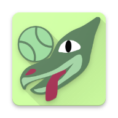
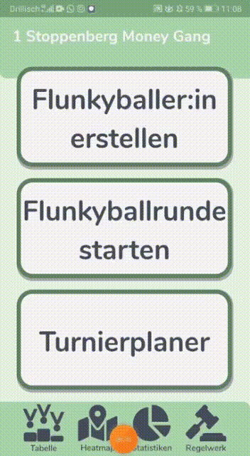
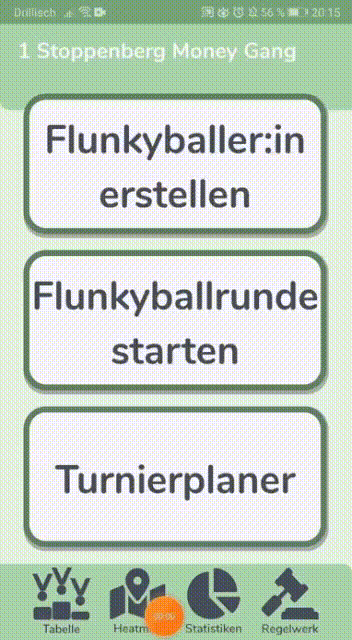
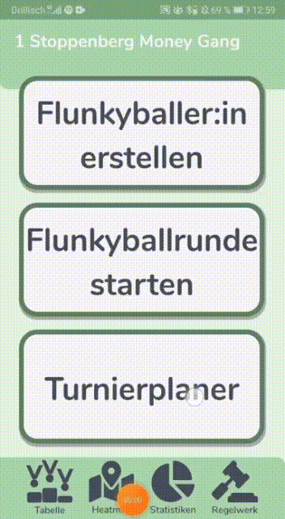

## Yo Flunk! Bringt euer Flunkyball-Erlebnis auf ein neues Level...

**Yo Flunk!** ist die Android-App, wenn es um das Organisieren und Visualisieren von Flunkyball-Spielen innerhalb eines kompetetiven Umfelds geht. 
Ihr gründet innerhalb eines Freundeskreises eine eigene Liga, welche euch einen Überblick über alle Matches verschafft. Das weckt bei dem Einen oder Anderen den kompetetiven Geist und führt zu neuen Bestleistungen (das haben wir tatsächlich empirisch beobachtet!). Einige essentielle Features der App sind die Folgenden:
 

### Einfaches Erstellen und Tracken von Flunkyballrunden

Per _Push-Up-Nachricht_ können alle Mitglieder der Liga benachrichtigt werden, wenn ein Spiel gespielt wird. Die Option _Spiel teilen per Heatmap_ lässt das Spiel auf einer Karte anzeigen. Die Integration der Google-Maps-API ermöglicht dabei eine nahtlose Navigation direkt zur Flunk-Partie.

### Liga-Übersicht mit eigens entwickeltem Elo-System 
So behält jedes Mitglied des Freundeskreises einen Überblick über den Liga-Fortschritt:

Die Statistiken ermöglichen eine nähere Untersuchung des Ligageschehens.

### Turnierplaner 
Ihr seid es auch Leid ein Turnier zu planen und den Ablauf manuell zu koordinieren? Dann benutzt den Turnierplaner!

## Habt ihr auch Lust die App in eurem Freundeskreis zu etablieren?
Dann schreibt mir gerne! Natürlich ist alles **kostenfrei**!

## Ihr habt Lust euch an dem Projekt zu beteiligen?
Auch dafür könnt ihr mich gerne kontaktieren. Ich freue mich über jede Unterstützung.
Die Hilfe kann vielseitig sein:
1. Es fehlen noch Features, die implementiert werden müssen (die App ist programmiert in Java). Der Code wird bald zusätzlich Open-Source zur Verfügung stehen. 
2. Es können immer weitere Logos und Buttons designed werden. 
3. Ihr habt Ideen für Verbesserung und neue Features? Immer her damit!
